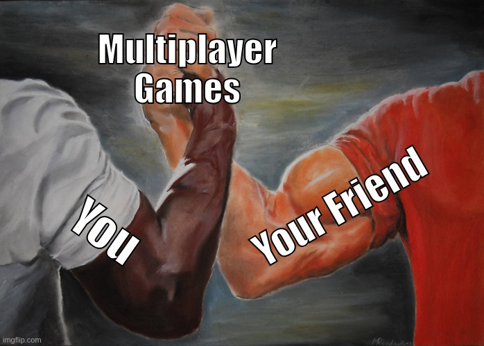

<p align="center">
  <a href="https://four43.github.io/handshake/"></a>
</p>

# Handshake

**[Docs](https://four43.github.io/handshake/)** · [Quickstart](https://four43.github.io/handshake/quickstart/) · [JS client API](https://four43.github.io/handshake/reference/client/) · [Protocol](https://four43.github.io/handshake/reference/protocol/)

A small WebRTC signaling server and room registry for four43.com browser games, plus the browser
client every game uses (`client/handshake.js`). It matches players into rooms and relays connection
setup; game data then goes peer to peer (host to each guest), through a TURN relay when it must.
The server never sees game data. `docs/specs/handshake-server.md` is the design.

<p align="center">
  
</p>

## Getting started

Run the server (Docker), then drop the client into your game.

```bash
cat > config.toml <<'EOF'
allow_localhost = true                  # lets http://localhost pages in; development only

[apps.my-game]
origins = ["https://you.github.io"]     # where your game is hosted
public_rooms = true
EOF
chmod 644 config.toml                   # the container runs as nonroot

docker run --rm -p 8080:8080 -e SESSION_SECRET=$(openssl rand -hex 32) \
  -v "$PWD/config.toml:/etc/handshake/config.toml:ro" ghcr.io/four43/handshake:v1

curl -O https://raw.githubusercontent.com/four43/handshake/main/client/handshake.js
```

```js
import { Handshake } from './handshake.js';

const hs = new Handshake({ server: 'http://localhost:8080', app: 'my-game', version: 1, name: 'Ada' });

// Host: create a room and share the link (?r=CODE&k=KEY)
const room = await hs.createRoom({ maxPlayers: 4 });
console.log(room.shareUrl);
room.on('peer', peer => peer.on('message', data => console.log(peer.name, data)));

// Guest (the page opened from that link): join and talk to the host
const joined = await hs.joinFromUrl();
joined?.on('peer', host => host.send({ hello: 'host' }, { reliable: true }));
```

`:v1` is the newest 1.x release; pin an exact version such as `:v1.0.0` if you prefer. The
[quickstart](https://four43.github.io/handshake/quickstart/) walks through this with error handling, and
[self-hosting](https://four43.github.io/handshake/guides/self-hosting/) covers TLS, TURN and production config.

## Configure

`config.example.toml` documents every key ([config reference](https://four43.github.io/handshake/reference/config/)).
Each game is an `[apps.<id>]` entry with its allowed origins and limits; `list = "none"` makes its rooms joinable
by code only. Secrets come from the environment, never the file: `SESSION_SECRET` (required, 32+ characters),
`SESSION_SECRET_PREV` (optional, for rotation), `TURN_SECRET` (must match coturn's `static-auth-secret`).

## Deploy

One Docker host runs Caddy (TLS, proxies `/session`, `/turn` and `/ws` to port 8080; keep `/metrics`
internal), this server and coturn (`network_mode: host`, a narrow relay port range, `external-ip`
behind NAT). The [self-hosting guide](https://four43.github.io/handshake/guides/self-hosting/) has the
compose file.

- The container runs as `nonroot`: mount `config.toml` with mode 644 (`chmod 644 config.toml`), or it
  cannot read it.
- `X-Forwarded-For` is believed only from `trusted_proxies` (loopback and private networks by default), so
  per-IP rate limits hold with Caddy on the Docker network and direct clients cannot spoof their address.
- The healthcheck is built in (`handshake --healthcheck`); `GET /healthz` returns `ok`.
- State is in memory: a restart closes every room.

## Development

`docs/specs/handshake-server.md` is the design.

### Test

```bash
scripts/test.sh                 # server: unit + socket integration tests (cargo runs in Docker)
cd client && npm test           # client: unit tests against fakes (Node 20+)
cd client && npm run e2e        # client + server: two Chromium pages, real WebRTC (needs Docker;
                                # first time: npm install && npx playwright install chromium)
```

### Run from source

```bash
docker build -t handshake .
cp config.example.toml config.toml && chmod 644 config.toml   # set allow_localhost = true for local games
docker run --rm -p 8080:8080 -e SESSION_SECRET=$(openssl rand -hex 32) \
  -v "$PWD/config.toml:/etc/handshake/config.toml:ro" handshake
```

### Docs site

`site/` is an [Astro Starlight](https://starlight.astro.build) site, published to GitHub Pages by
`.github/workflows/docs.yml`. The JS client reference is generated from `client/handshake.js`'s JSDoc by
TypeDoc. The WebSocket message and config references render `site/schemas/*.json`, which come from the
Rust types (`schemars`, test builds only). `cargo test` fails when they are stale.

```bash
cd site && npm install && npm run dev           # http://localhost:4321/handshake/
cd site && npm run images                        # redraw site/public/og.png and docs/banner.png
UPDATE_SCHEMAS=1 scripts/test.sh schemas_are_current   # after changing Config or the In enum
```

### Images and releases

`.github/workflows/docker.yml` runs the tests above, builds the image, checks its health and runs the end-to-end test
against that exact image, then pushes it to the GitHub Container Registry. Pull requests stop before the push.

- A push to `main` publishes `ghcr.io/four43/handshake:<short hash>`, for example `:577b002`.
- A git tag publishes `ghcr.io/four43/handshake:<tag>`. A release tag `vX.Y.Z` that is the newest of its major
  version also moves `:vX`, so `:v1` is always the latest 1.x. Pre-releases (`v2.0.0-rc.1`) and older patches
  publish only their own tag. There is no `:latest`.

```bash
git tag v1.2.3 && git push origin v1.2.3        # publishes :v1.2.3 and moves :v1
```

## Contributing and license

Everyone is welcome to use Handshake, self-host it, host it for others and contribute to it. Just don't charge
to host it for others.

- **Self-host it:** run, modify and deploy the server for your own games, free or commercial.
- **Host it for others:** run a public Handshake server for other developers, as long as it's free.
- **Use the client anywhere:** vendor `handshake.js` into any game, open or closed source. Keep its license header.
- **Contribute:** issues and pull requests are welcome. Run the tests in [Development](#development) first.
- **Not allowed:** charging others to host Handshake for them, or removing its license notices.

The server and the rest of this repository are under the [Business Source License 1.1](LICENSE) (BSL); the browser
client, [`client/handshake.js`](client/handshake.js), is [MIT](client/LICENSE). Each release of the server becomes
GPLv3 four years after it is published. The license files are what count; the list above is a summary.

By submitting a contribution you license it under the license of the files it changes, and you also grant Seth
Miller a perpetual, worldwide, royalty-free, irrevocable license to use, modify, sublicense and distribute it
under any terms, including as part of a paid hosted service. This keeps the project able to offer hosted Handshake.
