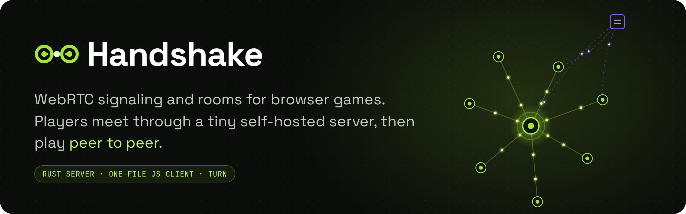

<p align="center">
  <a href="https://four43.github.io/handshake/"></a>
</p>

# Handshake

**[Docs](https://four43.github.io/handshake/)** · [Quickstart](https://four43.github.io/handshake/quickstart/) · [JS client API](https://four43.github.io/handshake/reference/client/) · [Protocol](https://four43.github.io/handshake/reference/protocol/)

A small WebRTC signaling server and room registry for four43.com browser games, plus the browser
client every game uses (`client/handshake.js`). It matches players into rooms and relays connection
setup; game data then goes peer to peer (host to each guest), through a TURN relay when it must.
The server never sees game data. `docs/specs/handshake-server.md` is the design.

## Test

```bash
scripts/test.sh                 # server: unit + socket integration tests (cargo runs in Docker)
cd client && npm test           # client: unit tests against fakes (Node 20+)
cd client && npm run e2e        # client + server: two Chromium pages, real WebRTC (needs Docker;
                                # first time: npm install && npx playwright install chromium)
```

## Docs site

`site/` is an [Astro Starlight](https://starlight.astro.build) site, published to GitHub Pages by
`.github/workflows/docs.yml`. The JS client reference is generated from `client/handshake.js`'s JSDoc by
TypeDoc. The WebSocket message and config references render `site/schemas/*.json`, which come from the
Rust types (`schemars`, test builds only). `cargo test` fails when they are stale.

```bash
cd site && npm install && npm run dev           # http://localhost:4321/handshake/
cd site && npm run images                        # redraw site/public/og.png and docs/banner.png
UPDATE_SCHEMAS=1 scripts/test.sh schemas_are_current   # after changing Config or the In enum
```

## Run locally

```bash
docker build -t handshake .
cp config.example.toml config.toml && chmod 644 config.toml   # set allow_localhost = true for local games
docker run --rm -p 8080:8080 -e SESSION_SECRET=$(openssl rand -hex 32) \
  -v "$PWD/config.toml:/etc/handshake/config.toml:ro" handshake
```

## Images

`.github/workflows/docker.yml` runs the tests above, builds the image, checks its health and runs the end-to-end test
against that exact image, then pushes it to the GitHub Container Registry. Pull requests stop before the push.

- A push to `main` publishes `ghcr.io/four43/handshake:<short hash>`, for example `:6fd9bf2`.
- A git tag publishes `ghcr.io/four43/handshake:<tag>`, for example `git tag v1.0.0 && git push origin v1.0.0` gives `:v1.0.0`.

## Configure

`config.example.toml` documents every key. Each game is an `[apps.<id>]` entry with its allowed
origins and limits; `list = "none"` makes its rooms joinable by code only. Secrets come from the
environment, never the file: `SESSION_SECRET` (required, 32+ characters), `SESSION_SECRET_PREV`
(optional, for rotation), `TURN_SECRET` (must match coturn's `static-auth-secret`).

## Deploy

One Docker host runs Caddy (TLS, proxies `/session`, `/turn` and `/ws` to port 8080; keep `/metrics`
internal), this server and coturn (`network_mode: host`, a narrow relay port range, `external-ip`
behind NAT). See `docs/specs/handshake-server.md` "Architecture and deployment" for the compose file.

- The container runs as `nonroot`: mount `config.toml` with mode 644 (`chmod 644 config.toml`), or it
  cannot read it.
- The healthcheck is built in (`handshake --healthcheck`); `GET /healthz` returns `ok`.
- State is in memory: a restart closes every room.
